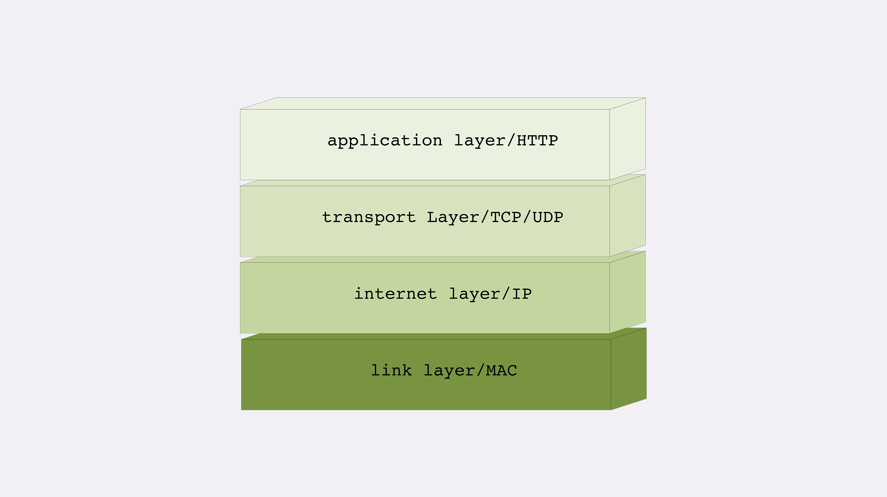
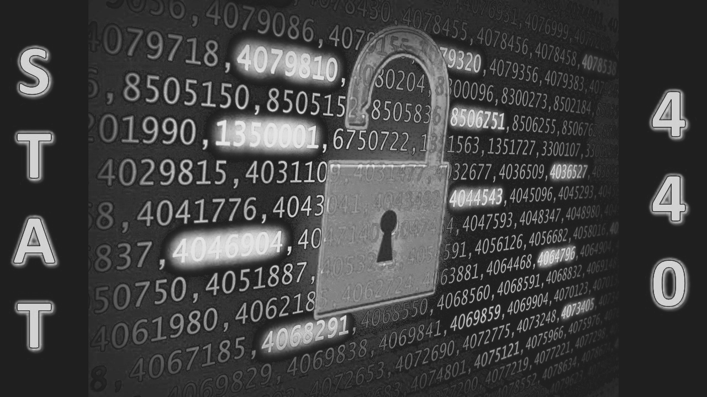

+++
date = '2024-03-19'
draft = false
title = 'UIUC Course Reviews'
description = 'My experience with CS and Statistics courses over 3+ years at UIUC.'
tags = ['UIUC', 'Course Review', 'CS', 'Statistics']
+++

> **Note:** This post was originally written in Chinese. This English version is an AI-assisted translation.

After nearly three years at UIUC, I realized I had taken a huge number of courses — between rushing to graduate during undergrad and filling in gaps during my master's, I probably took as many major courses as a typical four-year student here.

UIUC courses are labeled with a department prefix and number (e.g., CS 101). The 100/200/300/400+ levels roughly correspond to freshman through senior year, but difficulty doesn't strictly follow this order — some 300/400-level courses are taken by sophomores, while others are notoriously difficult (looking at you, CS systems/algorithms courses). Some 400/500-level courses double as graduate classes. I majored in Statistics for undergrad and CS for my master's, so most of the courses I took are in math, statistics, and computer science.

This is an entirely subjective review. What I found difficult or useful might be completely different for someone else, or with a different professor. Take everything here as a reference only. 😄

A useful website for grade distributions: [Grade disparity between sections at UIUC](https://waf.cs.illinois.edu/discovery/grade_disparity_between_sections_at_uiuc/)

---

## 2024 Spring

### CS 415 - Game Development

**Professor:** Eric Shaffer ｜ **Grade:** A

A resource-rich game design course. Eric's lectures are clear and easy to follow. The 4-credit course requires two MPs, a final project, and a VR game project. Homework consists of simple multiple-choice questions on PrairieLearn, and exams are also multiple-choice/fill-in-the-blank. Not super hard, but the workload is significant.

My overall experience wasn't great though — the MPs are heavy, UE5 isn't covered in lectures (you're on your own), and the CAs weren't very helpful in office hours. Many students treat it as an easy course, but the actual workload says otherwise. That said, if you go in genuinely wanting to learn game development, the experience could be quite different.

### CS 441 - Applied Machine Learning

**Professor:** Derek Hoiem ｜ **Grade:** A+

One of my absolute favorite courses. This was Derek's newly redesigned in-person version (not the Coursera one). The course content and assignments are very well-polished. It's also easy to do well — every assignment has extra credit, and as long as you complete the work and show up for exams, you'll get a good grade.

Derek clearly wanted to cover as much as possible, so the course is almost entirely application-focused with minimal theory. The pace is fast — from KNN at the start to BERT and GPT by the end. I highly recommend this as an ML entry course for anyone with basic statistics knowledge who wants a comprehensive introduction.

### CS 448 - Audio Computing

**Professor:** Paris Smaragdis ｜ **Grade:** A

Graded on 10 MPs and attendance. Covers Fourier transforms on audio, writing tunes, microphone array positioning, multi-channel audio processing, etc. Not my area of interest, but a perfectly fine course for filling credit requirements.

---

## 2023 Fall

### CS 427 - Software Engineering I

**Professor:** Lingming Zhang ｜ **Grade:** A+

A Coursera-based course on software engineering principles — meaning it's not too difficult. Around 5 MPs covering design patterns, testing, and code quality. The most memorable MP involved running test cases to check code coverage and auto-formatting.

The final project is a 6-person team building an Android app (ours was a weather app in Java). It's designed to simulate real industry workflows — planning, task distribution, and using git properly. Great if your teammates are good; painful if they're not. A solid, easy course that teaches useful workplace skills.

### CS 438 - Communication Networks

**Professor:** Romit Roy Choudhury ｜ **Grade:** A

Romit is one of my favorite professors. Despite his thick Indian accent, his lectures are fantastic — he remembers students' names and uses great examples. The course covers network architecture top-down: application, transport, network, and link layers.

Homework isn't hard, but the MPs are hardcore — especially MP2, where you implement TCP from scratch. I spent an enormous amount of time on it. Two exams covering IP addressing, TCP vs UDP, DNS, CIDR, etc. Very low-level content that's useful for certain careers. Great professor, but requires real effort.

### CS 543 - Computer Vision

**Professor:** David Forsyth ｜ **Grade:** A

A "traditional" CV course — mostly unrelated to machine learning. Covers camera transformations, spatial reconstruction, image alignment, and stitching.

The MPs are fun: aligning RGB channels, panorama stitching (like iPhone), and estimating building heights from different angles (using UIUC buildings!). But 5 MPs plus quizzes and a final project made the workload quite heavy. Forsyth is a legendary professor though — you'll learn a lot if you put in the effort.

---

## 2023 Spring

### STAT 426 - Statistical Modeling II

**Professor:** Douglas G Simpson ｜ **Grade:** A+

Required stats course. Simpson's courses are well-known for being easy. Covers logistic regression, GLMs, goodness of fit, link functions, count regression, log-linear models — essentially an extension of STAT 425. Exams and homework are all R-based and straightforward.

### STAT 427 - Statistical Consulting

**Professor:** Yuguo Chen ｜ **Grade:** A

A really fun course! You only need to attend at the start and end of the semester. PhDs and professors from other UIUC departments present their projects, and students form groups of 3-4 to work on one throughout the semester. My project was a regression model for the business school — not too hard. Only 5 undergrad spots per semester, so sign up early.

### STAT 430 - Unsupervised Learning

**Professor:** Tori Ellison ｜ **Grade:** A

Easy A, but the content is actually quite thorough — deep dives into common unsupervised learning algorithms. Homework is on the longer side, but grading and teaching are both excellent.

---

## 2022 Fall

### STAT 385 - Statistics Programming Methods

**Professor:** David Dalpiaz ｜ **Grade:** A+

A very basic R programming intro course. Covers syntax basics and dataset handling. Easy to understand, easy to score well. Great for R beginners.

### STAT 410 - Statistics and Probability II

**Professor:** Alexey G Stepanov ｜ **Grade:** A+

A continuation of STAT 400, focusing on distribution and probability derivations. Alex is one of UIUC Statistics' most famous professors — a fun Russian professor whose lectures are polished through years of experience. The content itself is dry, but Alex emphasizes applications in exams. If you study past exams thoroughly, you'll do great.

### STAT 425 - Statistical Modeling

**Professor:** Douglas G Simpson ｜ **Grade:** A+

Same experience as STAT 426.

### STAT 440 - Statistical Data Management

**Professor:** Christopher Kinson ｜ **Grade:** A

An extension of R data processing. Content is shallow and easy to understand. Homework is graded on submission. Many treat it as an easy course, but you can learn useful data processing skills if you take it seriously.

---

## 2022 Spring

### CS 128 - Intro to CS II

**Professor:** Michael Nowak ｜ **Grade:** A

Howdy! A fairly hardcore intro CS course. The MPs are quite challenging for beginners — if you don't have prior C++ experience, expect to spend significantly more time than on other courses. But it's a great course for learning C++. Recommended for freshmen.

### CS 411 - Database Systems

**Professor:** Abdussalam Alawini ｜ **Grade:** A+

Abdu speaks for himself — solid course, manageable workload. Recommended.

### STAT 400 - Statistics and Probability I

**Professor:** Albert Yu ｜ **Grade:** A+

Equivalent to intro probability and statistics. Albert is a fun lecturer — he wasn't even done with his own degree when I took it, so there's no generation gap. He uses League of Legends characters in examples! Easy homework, easy exams, great communication. Excellent intro course.

### MATH 416 - Abstract Linear Algebra

**Professor:** Pierre Albin ｜ **Grade:** A+

The content isn't the most exciting (it's linear algebra, after all), but Albin is a great person and the final wasn't too hard. Format: watch lectures at home, discuss in class.

---

## 2021 Fall

### MATH 347 - Fundamental Mathematics

**Professor:** Christopher Dodd ｜ **Grade:** A-

Not my favorite. The content varies heavily by professor — mine was teaching undergrads for the first time and went extremely fast, extending into topology and abstract algebra. Not friendly for someone with a weak math background like me. Only 5 people got A- across two sections, nobody got A. But that's on me, not the professor.

### CS 361 - Prob & Stat for CS

**Professor:** Hongye Liu ｜ **Grade:** A+

Content is essentially the same as STAT 400. Lots to do — exams and homework aren't hard, but the workload isn't small either.
